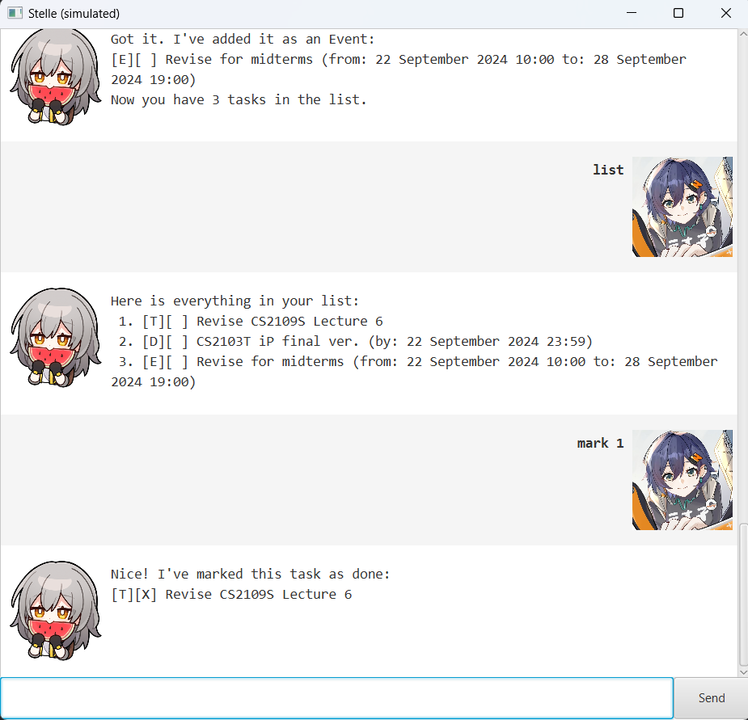

# Stelle User Guide



> When there is a chance to make a choice, make one that you know you won't regret... - Stelle (Honkai: Star Rail)

Stelle (Chat bot simulation) frees your mind of having to remember things you need to do. It is:
- text-based
- easy to learn
- BLAZING FAST to use :fire: :fire: :fire:

Stelle functions using commands typed into the text box! A list of functional commands are provided below!

## Starting Stelle

Simply double-click on the .jar file.  
All other required files will be created automatically on first startup.

## Adding Tasks

There are 3 types of tasks Stelle can handle. Each of them has a specific command syntax for adding them.

### Adding To-Dos

```
todo [task name]
```
Example: `todo Revise CS2109S Lecture 6`

Adds a To-Do to your tasks.

A To-Do has a name.

Stelle will save the To-Do, then respond with:

```
Got it. I've added it as a To Do:
[T][ ] Revise CS2109S Lecture 6
Now you have 3 tasks in the list.
```

### Adding Deadlines

```
deadline [task name] /by [YYYY-MM-DD HH:MM]
```
Example: `deadline Submit Project /by 2024-09-19 23:59`

Note: Date must be in the specified format!

Adds a Deadline to your tasks.

A Deadline has a name and a "by" date (when it should be done by).

Stelle will save the Deadline, then respond with: 

```
Got it. I've added it as a Deadline:
[D][ ] Submit Project (by: 19 September 2024 23:59)
Now you have 3 tasks in the list.
```

### Adding Events

```
event [task name] /from [YYYY-MM-DD HH:MM] /to [YYYY-MM-DD HH:MM]
```
Example: `event Recess week revisions /from 2024-09-22 10:00 /to 2024-09-27 19:00`

Note: Dates must be in the specified format!

Adds an Event to your tasks.

An Event has a name and "from" and "to" dates (denoting period when the event is taking place).

Stelle will save the Event, then respond with:

```
Got it. I've added it as an Event:
[E][ ] Recess week revisions (from: 22 September 2024 10:00 to: 27 September 2024 19:00)
Now you have 3 tasks in the list.
```

## Saving Tasks to File

Stelle automatically updates task storage during usage, and there is no need to manually save data.

Note: Data is stored at `/data/stelle.txt` within the directory `stelle.jar` is stored at.

## Marking Tasks as Done
```
mark [task number in list]
```
Marks a task as done. Indicated by an 'X' next to the task.

Stelle will mark the task, then respond with:

```
Nice! I've marked this task as done:
[T][X] Revise CS2109S Lecture 6
```

## Listing All Tasks

```
list
```
Lists all tasks that Stelle has.

Stelle will respond with:
```
Here is everything in your list:
1. [E][ ] Recess week revisions (from: 22 September 2024 10:00 to: 27 September 2024 19:00)
2. [D][ ] Submit Project (by: 19 September 2024 23:59)
3. [T][ ] Revise CS2109S Lecture 6
```
(tasks given are examples)

## Marking Tasks as undone
```
unmark [task number in list]
```
Marks a task as not done. Indicated by an ' ' next to the task.

Stelle will unmark the task, then respond with:

```
OK, I've marked this task as not done yet:
[T][ ] Revise CS2109S Lecture 6
```

## Deleting Tasks
```
delete [task number in list]
```
Example: `delete 3`  
IMPORTANT: Numbering of tasks may shift after a deletion!

Deletes a task.

Stelle will delete the task, then respond with:

```
Alright. Removed the task:
[T][ ] Revise CS2109S Lecture 6
```

## Exiting
```
bye
```
Stelle will close.